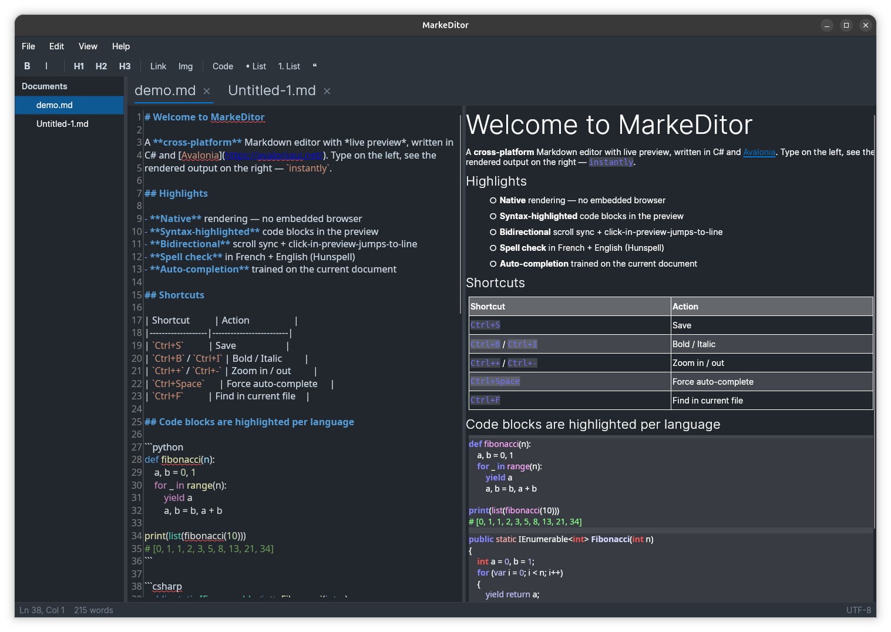

# MarkeDitor

Cross-platform Markdown editor with live preview, written in C# / Avalonia 11.
Single codebase, runs natively on **Linux**, **Windows** and **macOS**.

[](https://github.com/Bat51/MarkeDitor/releases/latest)




## Download

Pre-built binaries are attached to every release on the
[Releases page](https://github.com/Bat51/MarkeDitor/releases/latest):

- **Windows** — `MarkeDitor-Setup-x.y.z.exe` (installer, recommended) or `…-win-x64.zip` (portable)
- **Linux** — `…-linux-x64.tar.gz` (extract and run, or use `install-linux.sh` from the repo for a per-user install)

## Features

- **AvaloniaEdit** code editor with TextMate-powered Markdown syntax highlighting
- **Live preview** rendered with `Markdown.Avalonia`
- **Code blocks in preview are syntax-highlighted per language** (JS, Python, C#, Bash, …)
- **Bidirectional scroll sync** + click-in-preview-jumps-to-line
- **Word auto-completion** trained on the current document (Ctrl+Space to force)
- **Spell check** in French + English (Hunspell, suggestions on right click,
  "Add to dictionary" supported)
- **Tabbed editing**, file explorer, recent files, recovery on crash, reopen-last-tabs
- **Preferences**: font, font size, theme (dark/light/system), feature toggles
- **Zoom** Ctrl+= / Ctrl+- / Ctrl+0
- **Shortcuts**: Ctrl+S/Shift+S, Ctrl+O, Ctrl+N, Ctrl+W, Ctrl+F, Ctrl+B/I

## Repository layout

```
MarkeDitor/                 # the Avalonia project (C#, AXAML)
publish-linux.sh            # build + package linux-x64 release
publish-windows.sh          # build win-x64 release (cross-compile from Linux ok)
install-linux.sh            # per-user install: copies the build, registers the
                            # .desktop launcher and icon (no sudo needed)
uninstall-linux.sh
installer.iss               # Inno Setup script for the Windows installer
```

## Develop

Requires .NET SDK 8 or later.

```sh
cd MarkeDitor
dotnet run
```

## Build & install — Linux (Ubuntu / Debian)

```sh
./publish-linux.sh                  # → Publish/MarkeDitor-linux-x64/ (~100 MB)
./install-linux.sh                  # per-user install, no sudo
xdg-mime default markeditor.desktop text/markdown   # optional
```

The install drops:

| File | Purpose |
|---|---|
| `~/.local/share/markeditor/` | self-contained app folder |
| `~/.local/share/applications/markeditor.desktop` | launcher entry |
| `~/.local/share/icons/hicolor/256x256/apps/markeditor.png` | icon |

Spell-check needs `hunspell-fr` + `hunspell-en-us` (already installed on most
desktop distros):

```sh
sudo apt install hunspell-fr hunspell-en-us   # if missing
```

Uninstall: `./uninstall-linux.sh`.

## Build & install — Windows

Cross-build the .exe from any platform:

```sh
./publish-windows.sh                # → Publish/MarkeDitor-win-x64/bin/MarkeDitor.exe
```

Copy the folder to a Windows machine and run. To produce a real installer with
Start menu shortcut, file association and uninstaller, run [Inno Setup 6](https://jrsoftware.org/isinfo.php)
on `installer.iss` from a Windows machine.

## Stack

- [Avalonia](https://avaloniaui.net/) 11 — UI framework
- [AvaloniaEdit](https://github.com/AvaloniaUI/AvaloniaEdit) + AvaloniaEdit.TextMate — editor + syntax highlighting
- [Markdown.Avalonia](https://github.com/whistyun/Markdown.Avalonia) — live preview rendering
- [Markdig](https://github.com/xoofx/markdig) — Markdown parser
- [WeCantSpell.Hunspell](https://github.com/aarondandy/WeCantSpell.Hunspell) — spell checker
- [CommunityToolkit.Mvvm](https://github.com/CommunityToolkit/dotnet) — MVVM helpers

## Notes

- Window icon is set via `WindowIcon` and exposed through `_NET_WM_ICON`.
  GNOME Shell does not display window icons in the title bar; the Activities /
  taskbar entry uses the icon from the installed `.desktop` file.
- User data is stored under `~/.local/share/MarkeDitor/`:
  - `settings.json` — preferences, recent files, last open tabs, custom dictionary
  - `Recovery/` — auto-saved unsaved-tab snapshots

## License

[MIT](LICENSE) © Laurent Massy
